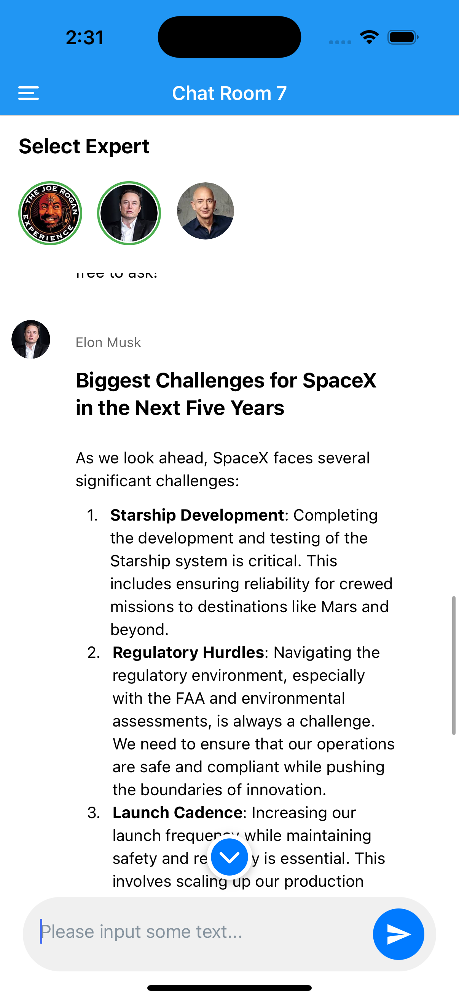

# RN AI Assistant

A full-stack development project featuring a React Native frontend and a Python backend.


## Development Environment Requirements

- Node.js 18+
- Python 3.8+
- Docker & Docker Compose
- Make

## Setting Up the Environment

### React Native

1. Ensure you have Node.js 18+ installed. You can download it from [Node.js official website](https://nodejs.org/).
2. Install Expo CLI globally:
   ```sh
   npm install -g expo-cli
   ```
3. Navigate to the project directory and install dependencies:
   ```sh
   make rn-install
   ```
4. Copy the example environment file:
   ```sh
   cp my-app/.env.example my-app/.env
   ```
5. Start the React Native development server:
   ```sh
   make rn-start
   ```
6. To run the app on an Android emulator:
   ```sh
   make rn-android
   ```
7. To run the app on an iOS simulator:
   ```sh
   make rn-ios
   ```
8. To clean the React Native project:
   ```sh
   make rn-clean
   ```

### Python (Docker)

1. Ensure you have Docker and Docker Compose installed. You can download them from [Docker official website](https://www.docker.com/).
2. Navigate to the project directory and build the Docker images:
   ```sh
   make build
   ```
3. Copy the example environment file:
   ```sh
   cp backend/.env.example backend/.env
   ```
4. Start the backend services:
   ```sh
   make up
   ```
5. To stop the backend services:
   ```sh
   make down
   ```

## Quick Start



### Frontend (React Native)

```sh
make rn-install    # Install React Native dependencies
make rn-start      # Start React Native development server
make rn-android    # Run on Android emulator
make rn-ios        # Run on iOS simulator
make rn-clean      # Clean React Native project
```

### Backend (Python)

```sh
make build         # Build Docker images
make up            # Start backend services
make down          # Stop backend services
make logs          # View backend logs
```
